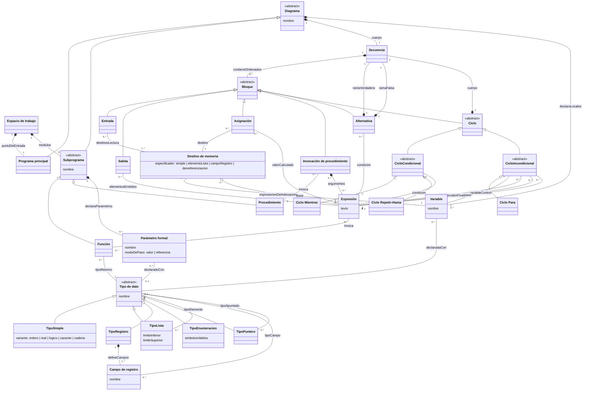
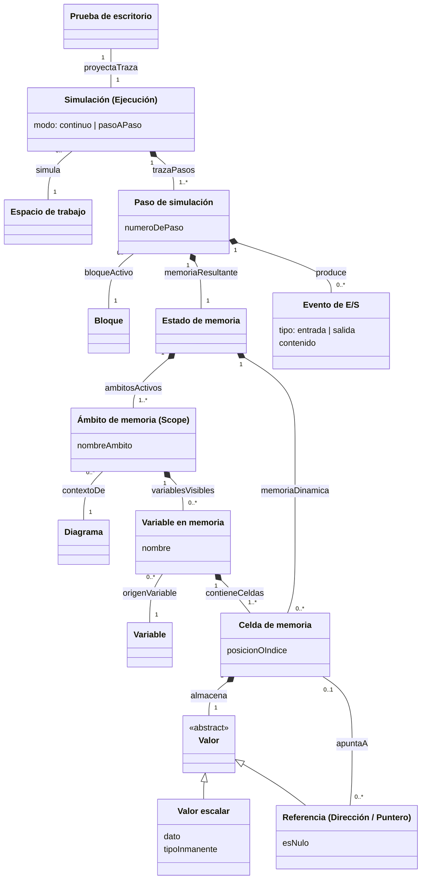
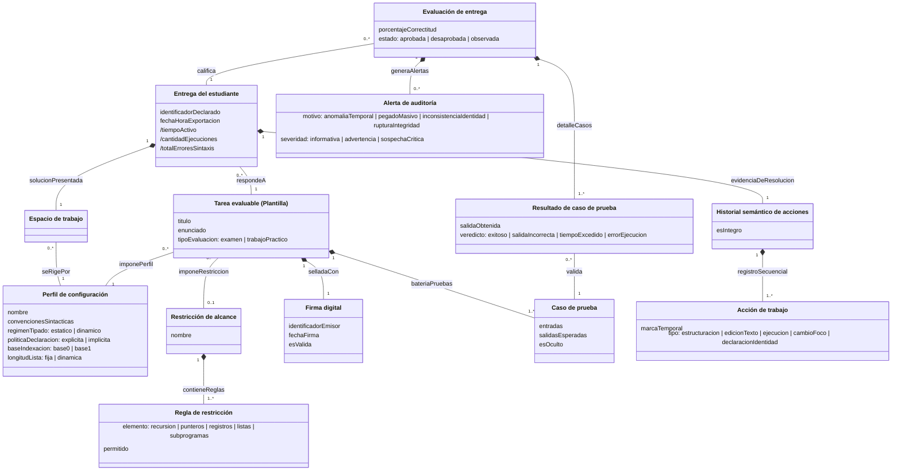

# Modelo de dominio

> **Versión:** `0.1.0`

## 1. Introducción

El **Modelo de Dominio** es una representación visual de las clases conceptuales
del mundo real identificadas para **Diagramar PWA**. Presentado desde una
**perspectiva conceptual**, este artefacto opera como un vocabulario visual de
términos, abstracciones y relaciones significativas del problema; no describe
clases de software ni incluye métodos, firmas de operaciones o detalles de
implementación.

El modelo se organiza en tres paquetes conceptuales:

1. **Estructura del algoritmo (Notación N-S):** Descomposición sintáctica de los
   estructogramas y modularidad.
2. **Simulación pedagógica (Prueba de escritorio):** Conceptos asociados a la
   ejecución observable y estado de la memoria.
3. **Configuración, evaluación didáctica y auditoría:** Instrumentos docentes,
   integridad criptográfica y calificación automática.

## 2. Estructura del algoritmo (Notación Nassi-Shneiderman)

Modela los componentes de un estructograma: la contigüidad jerárquica de
bloques, los destinos de memoria (_l-values_), las expresiones evaluables y el
sistema de tipos de datos.

## 3. Simulación pedagógica y prueba de escritorio

Modela la ejecución visible del algoritmo: la sucesión de pasos, la
actualización de la prueba de escritorio y la representación del estado de
memoria en función del ámbito vigente.

## 4. Configuración, evaluación didáctica y auditoría

Modela la parametrización del motor mediante perfiles, la inyección de
restricciones y casos de prueba, y el esquema de integridad criptográfica de las
entregas.

