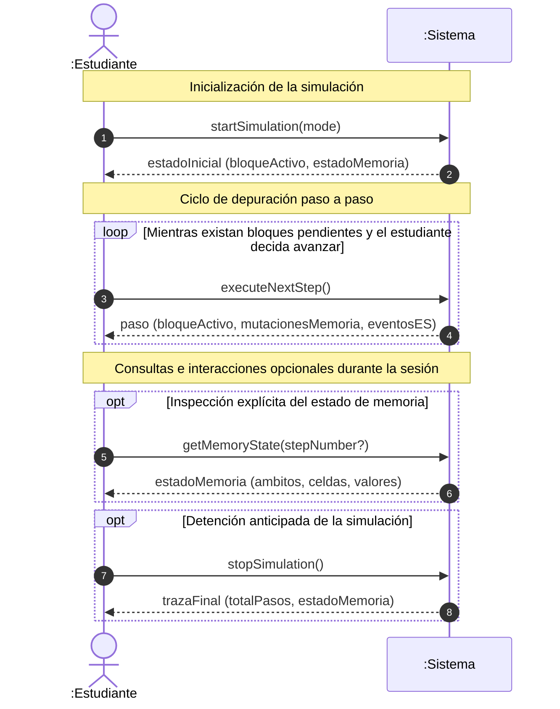

# Diagramas de secuencia del sistema: UC02

> **Versión:** `0.1.0`

## 1. Escenario principal de ejecución paso a paso en memoria (`BasicMemory`)

Este diagrama modela el flujo temporal donde el estudiante inicia la simulación
del programa principal, avanza instrucción por instrucción inspeccionando la
memoria, consulta el estado de las variables y concluye o aborta la depuración.

## 2. Catálogo de operaciones del sistema

A partir del DSS anterior se identifican y formalizan las siguientes
**operaciones del sistema**:

### 2.1 `startSimulation(mode)`

- **Tipo:** Comando.
- **Parámetros:**
  - `mode`: Valor enumerado que determina la estrategia de avance inicial
    (`CONTINUO` | `PASO_A_PASO`).
- **Intención:** Valida la consistencia sintáctica del diagrama activo,
  inicializa el entorno de ejecución (creación del ámbito de memoria global y
  reinicio de la prueba de escritorio) y posiciona el cursor en el bloque
  inicial.
- **Retorno:** `estadoInicial`, conteniendo el identificador del primer bloque a
  ejecutar y la estructura base de la memoria.

### 2.2 `executeNextStep()`

- **Tipo:** Comando.
- **Parámetros:** Ninguno.
- **Intención:** Ejecuta la instrucción asociada al bloque activo según la
  semántica Nassi-Shneiderman y el perfil de configuración vigente. Modifica los
  valores en las celdas de memoria, registra salidas/entradas producidas,
  actualiza la prueba de escritorio y avanza el cursor al siguiente bloque según
  la contigüidad espacial del estructograma.
- **Retorno:** Objeto `paso` que incluye:
  - `bloqueActivo`: Nodo ejecutado.
  - `mutacionesMemoria`: Lista de celdas modificadas en este paso.
  - `eventosES`: Entradas solicitadas o salidas impresas.
  - `estaFinalizado`: Booleano que indica si el algoritmo alcanzó su término
    natural.

### 2.3 `getMemoryState(stepNumber?)`

- **Tipo:** Consulta pura (conforme a CQS).
- **Parámetros:**
  - `stepNumber` _(opcional)_: Número de paso histórico a consultar. Si se
    omite, retorna el estado del paso actual.
- **Intención:** Permite a la interfaz de usuario o a los arneses de prueba
  inspeccionar la jerarquía de ámbitos de memoria activos, las variables
  declaradas y sus valores asociados sin producir efectos colaterales en la
  simulación.
- **Retorno:** `estadoMemoria` (instantánea de la memoria activa).

### 2.4 `stopSimulation()`

- **Tipo:** Comando.
- **Parámetros:** Ninguno.
- **Intención:** Aborta la ejecución activa de manera controlada, preservando la
  traza registrada en la prueba de escritorio y restableciendo el entorno al
  modo de edición.
- **Retorno:** `trazaFinal` acumulada.
