# Diagrama de clases de diseño: motor de dominio

> **Versión:** `0.1.0`

## 1. Introducción y decisiones arquitectónicas

El presente **diagrama de clases de diseño (DCD)** modela la perspectiva de software del subsistema central de ejecución
algorítmica (_Core Domain Engine_) de **Diagramar PWA**. A diferencia del [modelo de
dominio](../../01-business-modeling/domain-model.md) (perspectiva conceptual), este artefacto describe de manera
rigurosa las clases, interfaces, métodos, atributos tipados y relaciones de visibilidad implementadas en **TypeScript**,
bajo compilación estricta (`strict: true`).

El diseño satisface los siguientes requerimientos y decisiones arquitectónicas:

1. **Principio de separación modelo-vista:** El motor lógico es totalmente autónomo y agnóstico respecto a los
   componentes de presentación (Vue.js, DOM). No almacena referencias a ventanas, widgets ni elementos gráficos.
2. **Patrón intérprete con stepper explícito:**
   - La evaluación de expresiones aritméticas y booleanas aplica el patrón **Interpreter (GoF)** puro: `evaluate(scope)`
     recorre el subárbol recursivamente sin necesidad de pausas.
   - Las sentencias del estructograma aplican un **stepper explícito** mediado por una pila de marcos (`executionStack:
ExecutionFrame[]`): cada sentencia ejecuta su semántica atómica y devuelve una acción de control (`NextAction`),
     delegando el avance del puntero a la clase `Simulation`. Esto garantiza la ejecución paso a paso observable y la
     pausabilidad inmediata exigida por [UC02](../../02-requirements/use-cases/uc02.md) sin caer en llamadas recursivas
     bloqueantes.
3. **Patrones GRASP de asignación de responsabilidades:**
   - **Controlador:** La clase `AlgorithmInterpreter` canaliza las operaciones del sistema emitidas desde la interfaz o
     el arnés de pruebas (Vitest).
   - **Experto en información:** `MemoryScope` gestiona la resolución léxica y mutación de variables a través de
     `SymbolTable`; `ExpressionNode` evalúa valores en función del ámbito.
   - **Creador:** `Simulation` crea el ámbito raíz, la pila de marcos inicial y la traza de ejecución;
     `AlgorithmInterpreter` crea la instancia de `Simulation`.
   - **Mapeo conceptual directo:** `ExpressionNode` y los nodos de sentencias mapean directamente los conceptos
     `Expresión` y `Bloque` del [modelo de dominio](../../01-business-modeling/domain-model.md).
   - **Fabricación pura:** Clases como `MemoryScope`, `SymbolTable`, `ExecutionTrace` y `ExecutionContext` se introducen
     para mantener alta cohesión y bajo acoplamiento.
4. **Separación comando-consulta (CQS):** Las operaciones que alteran el estado (`step()`, `setVariableValue()`) son
   métodos de tipo comando, mientras que la inspección (`getMemoryState()`, `evaluate()`, `getSnapshot()`) es libre de
   efectos colaterales.
5. **Representación de memoria mediante uniones discriminadas (_tagged unions_):** Los valores en tiempo de ejecución
   (`RuntimeValue`) desacoplan el almacenamiento de las reglas de coerción y tipado impuestas por el perfil activo.

## 2. Diagrama de clases de diseño general

```mermaid
classDiagram
    direction TB

    %% ==========================================
    %% Controlador y coordinación de simulación
    %% ==========================================
    class AlgorithmInterpreter {
        -currentSimulation: Simulation | null
        +startSimulation(program: ProgramNode, mode: ExecutionMode): ExecutionStep
        +executeNextStep(): ExecutionStep
        +getMemoryState(stepNumber?: number): MemorySnapshot
        +stopSimulation(): TraceSummary
    }

    class Simulation {
        -status: SimulationStatus
        -mode: ExecutionMode
        -executionStack: ExecutionFrame[]
        -rootScope: MemoryScope
        -trace: ExecutionTrace
        +constructor(program: ProgramNode, mode: ExecutionMode)
        +step(): ExecutionStep
        +getStatus(): SimulationStatus
        +setStatus(status: SimulationStatus): void
        +stop(): void
        +getMemorySnapshot(stepNumber?: number): MemorySnapshot
        -initExecutionStack(statements: StatementNode[]): void
        -captureMemorySnapshot(): MemorySnapshot
        -handleNextAction(action: NextAction): void
    }

    class ExecutionFrame {
        -statements: StatementNode[]
        -index: number
        +constructor(statements: StatementNode[])
        +getCurrentStatement(): StatementNode | null
        +advance(): void
        +isFinished(): boolean
        +getIndex(): number
    }

    class ExecutionTrace {
        -steps: ExecutionStep[]
        +constructor()
        +recordStep(step: ExecutionStep): void
        +getStep(stepNumber: number): ExecutionStep
        +getLastStep(): ExecutionStep
        +getTotalSteps(): number
        +getSummary(): TraceSummary
    }

    class ExecutionStep {
        +stepNumber: number
        +activeNode: StatementNode | null
        +mutations: MutationRecord[]
        +isFinished: boolean
        -memorySnapshot: MemorySnapshot
        +constructor(stepNumber: number, activeNode: StatementNode | null, memorySnapshot: MemorySnapshot, result?: ExecutionResult)
        +getMemorySnapshot(): MemorySnapshot
    }

    class ExecutionContext {
        +scope: MemoryScope
        +constructor(scope: MemoryScope)
    }

    AlgorithmInterpreter "1" --> "0..1" Simulation : -currentSimulation
    Simulation "1" *-- "1" ExecutionTrace : -trace
    Simulation "1" --> "1" MemoryScope : -rootScope
    Simulation "1" *-- "0..*" ExecutionFrame : -executionStack
    ExecutionTrace "1" *-- "0..*" ExecutionStep : -steps
    Simulation ..> ExecutionContext : crea

    %% ==========================================
    %% Jerarquía del AST (inmutable / Composite)
    %% ==========================================
    class ASTNode {
        <<interface>>
        +id: string
        +line: number | null
    }

    class StatementNode {
        <<interface>>
        +execute(context: ExecutionContext): ExecutionResult
    }

    class ExpressionNode {
        <<interface>>
        +evaluate(scope: MemoryScope): RuntimeValue
    }

    ASTNode <|-- StatementNode
    ASTNode <|-- ExpressionNode

    class ProgramNode {
        +name: string
        -body: SequenceNode
        +constructor(name: string, body: SequenceNode)
        +getBody(): SequenceNode
    }

    class SequenceNode {
        -statements: StatementNode[]
        +constructor(statements?: StatementNode[])
        +getStatements(): StatementNode[]
    }

    class AssignmentNode {
        +target: MemoryDestination
        -expression: ExpressionNode
        +constructor(target: MemoryDestination, expression: ExpressionNode)
        +execute(context: ExecutionContext): ExecutionResult
    }

    class IfNode {
        -condition: ExpressionNode
        -trueBranch: SequenceNode
        -falseBranch: SequenceNode | null
        +constructor(condition: ExpressionNode, trueBranch: SequenceNode, falseBranch?: SequenceNode | null)
        +execute(context: ExecutionContext): ExecutionResult
    }

    class WhileNode {
        -condition: ExpressionNode
        -body: SequenceNode
        +constructor(condition: ExpressionNode, body: SequenceNode)
        +execute(context: ExecutionContext): ExecutionResult
    }

    ASTNode <|.. ProgramNode
    ASTNode <|.. SequenceNode
    StatementNode <|.. AssignmentNode
    StatementNode <|.. IfNode
    StatementNode <|.. WhileNode

    ProgramNode "1" *-- "1" SequenceNode : -body
    SequenceNode "1" *-- "0..*" StatementNode : -statements
    IfNode "1" *-- "1" SequenceNode : -trueBranch
    IfNode "1" *-- "0..1" SequenceNode : -falseBranch
    WhileNode "1" *-- "1" SequenceNode : -body
    AssignmentNode "1" *-- "1" ExpressionNode : -expression
    IfNode "1" *-- "1" ExpressionNode : -condition
    WhileNode "1" *-- "1" ExpressionNode : -condition

    %% ==========================================
    %% Jerarquía de expresiones (Interpreter GoF)
    %% ==========================================
    class BinaryOpNode {
        -operator: BinaryOperator
        -left: ExpressionNode
        -right: ExpressionNode
        +constructor(operator: BinaryOperator, left: ExpressionNode, right: ExpressionNode)
        +evaluate(scope: MemoryScope): RuntimeValue
    }

    class UnaryOpNode {
        -operator: UnaryOperator
        -expression: ExpressionNode
        +constructor(operator: UnaryOperator, expression: ExpressionNode)
        +evaluate(scope: MemoryScope): RuntimeValue
    }

    class LiteralNode {
        -value: RuntimeValue
        +constructor(value: RuntimeValue)
        +evaluate(scope: MemoryScope): RuntimeValue
    }

    class VariableRefNode {
        +identifier: string
        +constructor(identifier: string)
        +evaluate(scope: MemoryScope): RuntimeValue
    }

    ExpressionNode <|.. BinaryOpNode
    ExpressionNode <|.. UnaryOpNode
    ExpressionNode <|.. LiteralNode
    ExpressionNode <|.. VariableRefNode

    BinaryOpNode "1" *-- "1" ExpressionNode : -left
    BinaryOpNode "1" *-- "1" ExpressionNode : -right
    UnaryOpNode "1" *-- "1" ExpressionNode : -expression

    %% ==========================================
    %% Infraestructura de memoria y ámbitos
    %% ==========================================
    class MemoryScope {
        +name: string
        -parentScope: MemoryScope | null
        -symbolTable: SymbolTable
        +constructor(name: string, parent?: MemoryScope | null)
        +setVariableValue(identifier: string, value: RuntimeValue): MutationRecord
        +getVariableValue(identifier: string): RuntimeValue
        +resolveSymbol(identifier: string): Symbol | null
        +hasVariable(identifier: string): boolean
        +getSnapshot(): ScopeSnapshot
    }

    class SymbolTable {
        -symbols: Map~string, Symbol~
        +constructor()
        +define(name: string, type: DataType, initialValue?: RuntimeValue): Symbol
        +lookup(name: string): Symbol | null
        +has(name: string): boolean
        +getAllSymbols(): Symbol[]
    }

    class Symbol {
        +name: string
        +type: DataType
        -cell: MemoryCell
        +constructor(name: string, type: DataType, cell: MemoryCell)
        +getCell(): MemoryCell
        +getValue(): RuntimeValue
        +setValue(newValue: RuntimeValue): void
    }

    class MemoryCell {
        +id: string
        -value: RuntimeValue
        +constructor(id: string, initialValue: RuntimeValue)
        +getValue(): RuntimeValue
        +setValue(newValue: RuntimeValue): void
    }

    MemoryScope "1" o-- "0..1" MemoryScope : -parentScope
    MemoryScope "1" *-- "1" SymbolTable : -symbolTable
    SymbolTable "1" *-- "0..*" Symbol : -symbols
    Symbol "1" *-- "1" MemoryCell : -cell
    MemoryCell "1" --> "1" RuntimeValue : -value

    %% ==========================================
    %% Tipos, estructuras y objetos de valor
    %% ==========================================
    class SimpleType {
        <<enumeration>>
        INTEGER
        REAL
        BOOLEAN
        CHAR
        STRING
    }

    class DataType {
        +kind: SimpleType
    }

    class RuntimeValue {
        +type: DataType
        +value: PrimitiveValue
    }

    class ActionType {
        <<enumeration>>
        ADVANCE
        PUSH_FRAME
        PUSH_AND_ADVANCE
    }

    class NextAction {
        +type: ActionType
        +statements: StatementNode[]
    }

    class ExecutionResult {
        +mutations: MutationRecord[]
        +nextAction: NextAction
        +constructor(mutations: MutationRecord[], nextAction: NextAction)
    }

    class MutationRecord {
        +variableName: string
        +scopeName: string
        +previousValue: RuntimeValue | null
        +newValue: RuntimeValue
    }

    class MemorySnapshot {
        +scopes: ScopeSnapshot[]
        +constructor(scopes: ScopeSnapshot[])
    }

    class ScopeSnapshot {
        +name: string
        +variables: Map~string, RuntimeValue~
        +constructor(name: string, variables: Map~string, RuntimeValue~)
    }

    StatementNode ..> ExecutionResult : retorna
    ExecutionStep "1" --> "0..*" MutationRecord : +mutations
    ExecutionStep "1" --> "1" MemorySnapshot : -memorySnapshot
    MemorySnapshot "1" *-- "1..*" ScopeSnapshot : +scopes
    MemoryScope ..> ScopeSnapshot : produce
    Simulation ..> MemorySnapshot : captura
    ExecutionResult "1" --> "0..*" MutationRecord : +mutations
    ExecutionResult "1" --> "1" NextAction : +nextAction
    NextAction "1" --> "1" ActionType : +type
    Symbol "1" --> "1" DataType : +type
    RuntimeValue "1" --> "1" DataType : +type
    DataType "1" --> "1" SimpleType : +kind
```

## 3. Especificación detallada de componentes

### 3.1 Controlador y coordinación de la simulación

#### `AlgorithmInterpreter`

- **Rol arquitectónico:** Controlador de fachada (_Facade Controller_) de la capa de dominio. Es el punto de entrada
  exclusivo para las operaciones del sistema identificadas en los [DSS UC02](../../02-requirements/ssd/uc02.md).
- **Responsabilidades:**
  - Coordinar la creación, avance paso a paso y detención de la simulación activa.
  - Proveer acceso de solo lectura al estado de memoria de la simulación en curso (principio CQS).
  - Recibir el árbol sintáctico `ProgramNode` construido por el analizador sintáctico de la capa superior y entregarlo a
    `Simulation`.
- **Colaboraciones:** Crea y delega el flujo a instancias de `Simulation`.

#### `Simulation`

- **Rol arquitectónico:** Experto en información y mediador del ciclo de vida de la ejecución algorítmica. Mantiene el
  estado operativo de la prueba de escritorio y la pila de marcos de ejecución.
- **Atributos:**
  - `status: SimulationStatus`: Estado de la ejecución (`READY`, `RUNNING`, `PAUSED`, `FINISHED`, `ERROR`, `STOPPED`).
  - `mode: ExecutionMode`: Modo de avance (`STEP_BY_STEP` o `CONTINUOUS`).
  - `executionStack: ExecutionFrame[]`: Pila de marcos que gobierna el cursor activo de ejecución en el estructograma.
  - `rootScope: MemoryScope`: Ámbito de memoria global de la sesión.
  - `trace: ExecutionTrace`: Colección histórica de pasos ejecutados.
- **Métodos principales:**
  - `step(): ExecutionStep`: Inspecciona la cima de `executionStack`, obtiene la sentencia activa
    (`currentFrame.getCurrentStatement()`), invoca su `execute(context)`, delega la acción resultante a
    `handleNextAction(action)`, registra el paso en la traza y retorna el `ExecutionStep`.
  - `handleNextAction(action: NextAction)`: Aplica las directivas sobre la pila: `ADVANCE` (avanza el índice del marco
    actual), `PUSH_FRAME` (apila una nueva secuencia sin avanzar el marco actual) o `PUSH_AND_ADVANCE` (avanza el marco
    actual y apila la nueva secuencia).
  - `initExecutionStack(statements: StatementNode[])`: Inicializa la pila de ejecución con las sentencias raíz del
    programa.
  - `captureMemorySnapshot(): MemorySnapshot`: Consolida instantáneas profundas de los ámbitos activos (`ScopeSnapshot`)
    en un objeto inmutable de sesión.

#### `ExecutionFrame`

- **Rol arquitectónico:** Entidad de sesión y mediador del cursor de ejecución secuencial en un bloque estructurado.
- **Responsabilidades:**
  - Mantener la referencia a la secuencia de sentencias activa (`statements: StatementNode[]`).
  - Registrar el índice actual de la instrucción en cómputo (`index: number`).
  - Avanzar el cursor secuencial (`advance()`) e informar cuándo se ha alcanzado el final del bloque (`isFinished()`).

#### `ExecutionTrace` y `ExecutionStep`

- **Rol arquitectónico:** Objetos de valor y registro histórico de la prueba de escritorio.
- **Responsabilidades:** Almacenar instantáneas inmutables de cada paso (`ExecutionStep`), permitiendo la inspección
  temporal libre de efectos colaterales y la base para la futura función de retroceso (_step-back_).

### 3.2 Jerarquía del AST de sentencias (_statement nodes_)

Modela la semántica de ejecución de las estructuras Nassi-Shneiderman aplicando el enfoque de **stepper explícito** y el
principio de **Polimorfismo** (GRASP).

| Clase                             | Atributos clave                                                                                  | Comportamiento en `execute(context: ExecutionContext)`                                                                                                                                                                             |
| :-------------------------------- | :----------------------------------------------------------------------------------------------- | :--------------------------------------------------------------------------------------------------------------------------------------------------------------------------------------------------------------------------------- |
| **`StatementNode`** _(interface)_ | `id: string` `line: number \| null`                                                           | Contrato polimórfico base para toda sentencia ejecutable del estructograma.                                                                                                                                                        |
| **`AssignmentNode`**              | `target: MemoryDestination` `expression: ExpressionNode`                                      | Evalúa la expresión en el ámbito (`context.scope`), invoca `scope.setVariableValue` y retorna la mutación con `Action.ADVANCE`.                                                                                                    |
| **`IfNode`**                      | `condition: ExpressionNode` `trueBranch: SequenceNode` `falseBranch: SequenceNode \| null` | Evalúa la condición booleana. Retorna `Action.PUSH_AND_ADVANCE(trueBranch.statements)` si es verdadera, `Action.PUSH_AND_ADVANCE(falseBranch.statements)` si es falsa con rama existente, o `Action.ADVANCE` si es falsa sin rama. |
| **`WhileNode`**                   | `condition: ExpressionNode` `body: SequenceNode`                                              | Evalúa la condición lógica. Si es verdadera, retorna `Action.PUSH_FRAME(body.statements)` (sin avanzar el marco padre). Si es falsa, retorna `Action.ADVANCE` (avanzando el marco padre para salir del ciclo).                     |
| **`SequenceNode`**                | `statements: StatementNode[]`                                                                    | Contenedor estructural de sentencias. Expone la colección de nodos hijos (`getStatements()`) para la inicialización de marcos `ExecutionFrame` en la pila. No es una instrucción ejecutable atómica.                               |
| **`ProgramNode`**                 | `name: string` `body: SequenceNode`                                                           | Raíz del programa. Expone el cuerpo principal para iniciar la ejecución en `Simulation`.                                                                                                                                           |

### 3.3 Jerarquía de expresiones evaluables (_expression nodes_)

Representa las fórmulas aritméticas, relacionales y lógicas que componen las asignaciones y condiciones de control.
Aplica el patrón **Interpreter (GoF)** recursivo clásico. Todas las expresiones implementan la interfaz `ExpressionNode`
con la firma `evaluate(scope: MemoryScope): RuntimeValue`.

- **`BinaryOpNode`:** Aplica operadores binarios aritméticos y lógicos (`+`, `-`, `*`, `/`, `%`, `^`, `==`, `!=`, `<`,
  `<=`, `>`, `>=`, `and`, `or`) sobre dos subárboles de expresión.
- **`UnaryOpNode`:** Aplica operadores unarios (`-`, `+`, `not`).
- **`LiteralNode`:** Encapsula una constante inmutable (`RuntimeValue`), retornándola directamente al evaluarse.
- **`VariableRefNode`:** Resuelve el valor actual de un identificador consultando a
  `scope.getVariableValue(this.identifier)`.

### 3.4 Infraestructura de memoria, tablas de símbolos y ámbitos

#### `MemoryScope`

- **Rol arquitectónico:** Experto en información sobre el contexto de visibilidad y coordinador de la cadena de
  resolución léxica de variables (fabricación pura).
- **Responsabilidades:**
  - Gestionar la delegación jerárquica hacia `parentScope`.
  - Atender las solicitudes de lectura y escritura de variables delegando la definición y búsqueda en su `SymbolTable`.
  - Producir instantáneas inmutables congeladas (`ScopeSnapshot`) para la prueba de escritorio.

#### `SymbolTable`

- **Rol arquitectónico:** Fabricación pura que encapsula el diccionario de identificadores declarados y sus metadatos en
  un ámbito específico.
- **Responsabilidades:**
  - Registrar nuevos símbolos vinculando su identificador con su tipo de dato (`DataType`) y su celda de almacenamiento
    (`define`).
  - Recuperar símbolos locales por nombre (`lookup`).

#### `Symbol`

- **Rol arquitectónico:** Representación en software del concepto `VariableEnMemoria` del [modelo de
  dominio](../../01-business-modeling/domain-model.md).
- **Responsabilidades:**
  - Mantener la correlación entre el identificador de la variable, su `DataType` y la `MemoryCell` que almacena su
    estado.

#### `MemoryCell`

- **Rol arquitectónico:** Contenedor físico de un valor en memoria (mapeo de `CeldaDeMemoria` en el [modelo de
  dominio](../../01-business-modeling/domain-model.md)).
- **Responsabilidades:**
  - Almacenar y retornar el `RuntimeValue` asignado a la celda.

## 4. Tipos y uniones discriminadas

Las estructuras de datos auxiliares que delimitan los contratos de la capa de dominio se especifican a continuación:

| Tipo / estructura   | Naturaleza     | Descripción                                                                              |
| :------------------ | :------------- | :--------------------------------------------------------------------------------------- |
| `ExecutionMode`     | Enumeración    | Modo de ejecución: `'STEP_BY_STEP'` o `'CONTINUOUS'`.                                    |
| `SimulationStatus`  | Enumeración    | Ciclo de vida: `'READY'`, `'RUNNING'`, `'PAUSED'`, `'FINISHED'`, `'ERROR'`, `'STOPPED'`. |
| `ActionType`        | Enumeración    | Tipo de control sobre la pila: `'ADVANCE'`, `'PUSH_FRAME'`, `'PUSH_AND_ADVANCE'`.        |
| `NextAction`        | _Tagged union_ | Directiva emitida por un nodo hacia `Simulation` para manipular `executionStack`.        |
| `SimpleType`        | Enumeración    | Tipos escalares: `'INTEGER'`, `'REAL'`, `'BOOLEAN'`, `'CHAR'`, `'STRING'`.               |
| `DataType`          | Estructura     | Metadatos de tipado: categoría simple (`kind: SimpleType`).                              |
| `RuntimeValue`      | _Tagged union_ | Objeto de valor inmutable compuesto por `type: DataType` y `value: PrimitiveValue`.      |
| `MemoryDestination` | Estructura     | Identificador de variable destino (_l-value_ escalar).                                   |
| `MutationRecord`    | Estructura     | Registro de mutación: variable, ámbito, valor anterior y nuevo valor.                    |
| `ExecutionResult`   | Estructura     | Resultado de sentencia: lista de mutaciones y acción de control (`NextAction`).          |
| `ScopeSnapshot`     | Estructura     | Copia profunda inmutable y congelada (`Object.freeze`) de las variables de un ámbito.    |
| `MemorySnapshot`    | Estructura     | Instantánea inmutable consolidada de todos los ámbitos en el paso $N$.                   |
| `TraceSummary`      | Estructura     | Resumen final tras completar o interrumpir la simulación.                                |

## 5. Trazabilidad con contratos de operación (DSS)

La siguiente matriz certifica el cumplimiento entre las firmas de métodos de diseño y los contratos de operación
establecidos en la disciplina de requisitos:

| Contrato                                                                                  | Operación del sistema (DSS)                                                                            | Método en clase de diseño                             | Clases colaboradoras en el diseño                                                         |
| :---------------------------------------------------------------------------------------- | :----------------------------------------------------------------------------------------------------- | :---------------------------------------------------- | :---------------------------------------------------------------------------------------- |
| [**CO1**](../../02-requirements/operation-contracts/uc02.md#contrato-co1-startsimulation) | [`startSimulation(programa, mode)`](../../02-requirements/ssd/uc02.md#21-startsimulationprograma-mode) | `AlgorithmInterpreter.startSimulation(program, mode)` | `Simulation`, `ExecutionFrame`, `MemoryScope`, `ExecutionTrace`, `ExecutionStep`          |
| [**CO2**](../../02-requirements/operation-contracts/uc02.md#contrato-co2-executenextstep) | [`executeNextStep()`](../../02-requirements/ssd/uc02.md#22-executenextstep)                            | `AlgorithmInterpreter.executeNextStep()`              | `Simulation`, `ExecutionFrame`, `StatementNode.execute(...)`, `MemoryScope`, `MemoryCell` |
| [**CO3**](../../02-requirements/operation-contracts/uc02.md#contrato-co3-getmemorystate)  | [`getMemoryState(stepNumber?)`](../../02-requirements/ssd/uc02.md#23-getmemorystatestepnumber)         | `AlgorithmInterpreter.getMemoryState(stepNumber?)`    | `Simulation`, `ExecutionTrace`, `ExecutionStep.getMemorySnapshot()`                       |
| [**CO4**](../../02-requirements/operation-contracts/uc02.md#contrato-co4-stopsimulation)  | [`stopSimulation()`](../../02-requirements/ssd/uc02.md#24-stopsimulation)                              | `AlgorithmInterpreter.stopSimulation()`               | `Simulation.stop()`, `ExecutionTrace.getSummary()`                                        |
