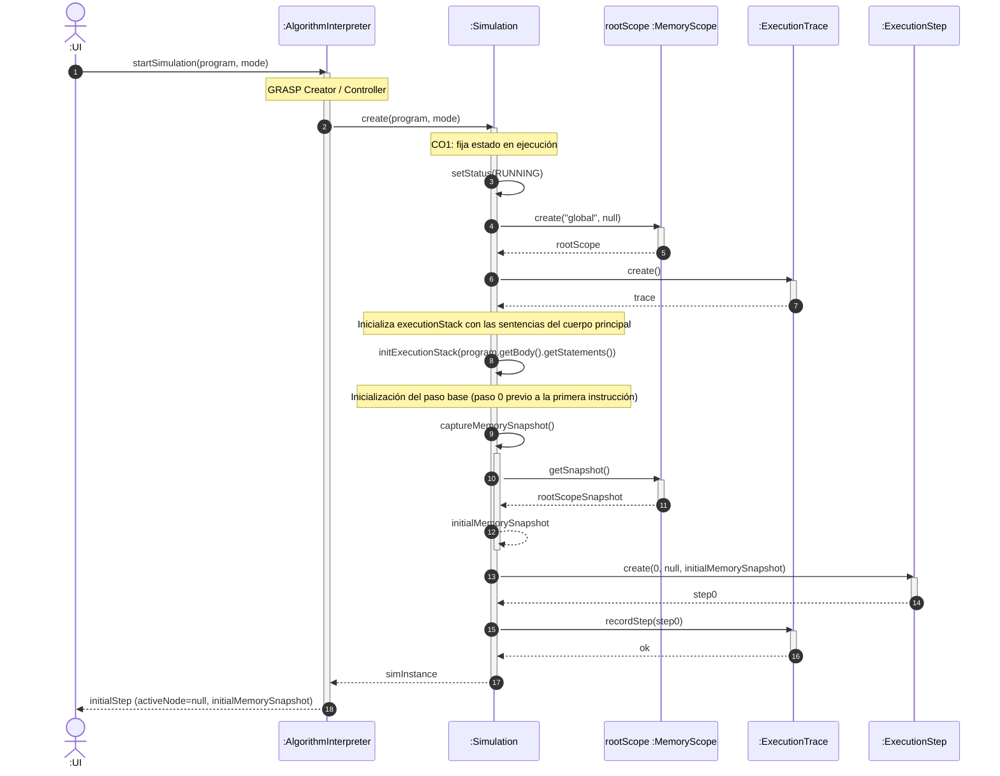
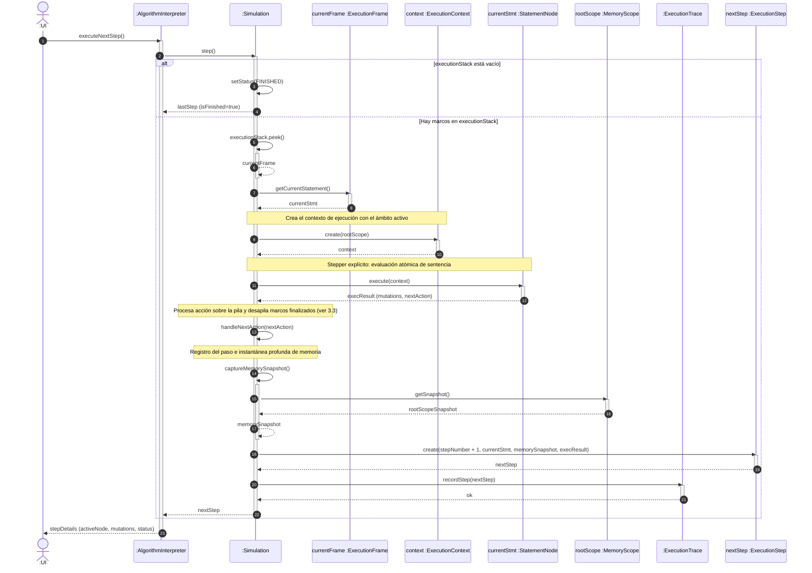
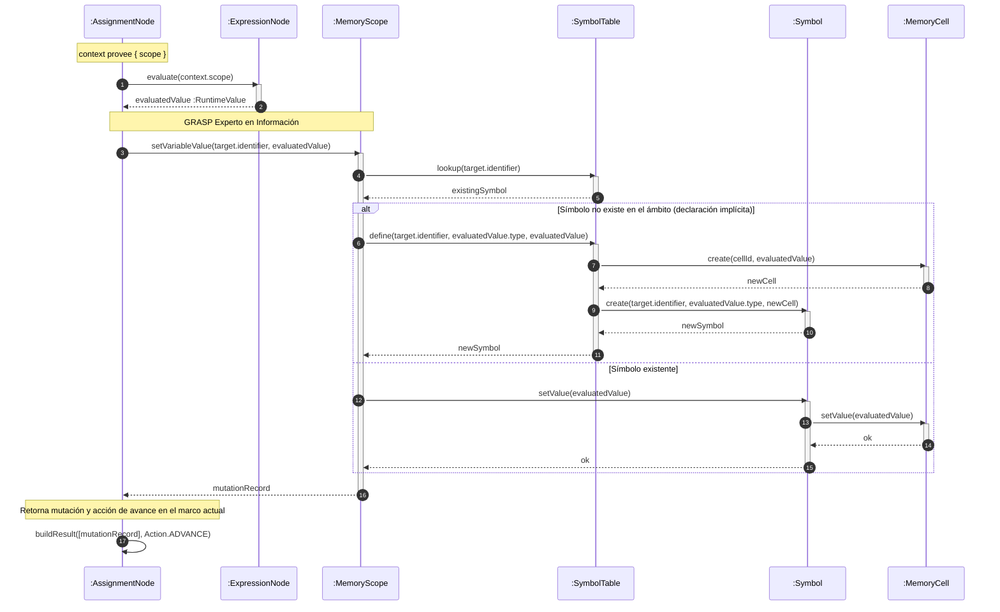
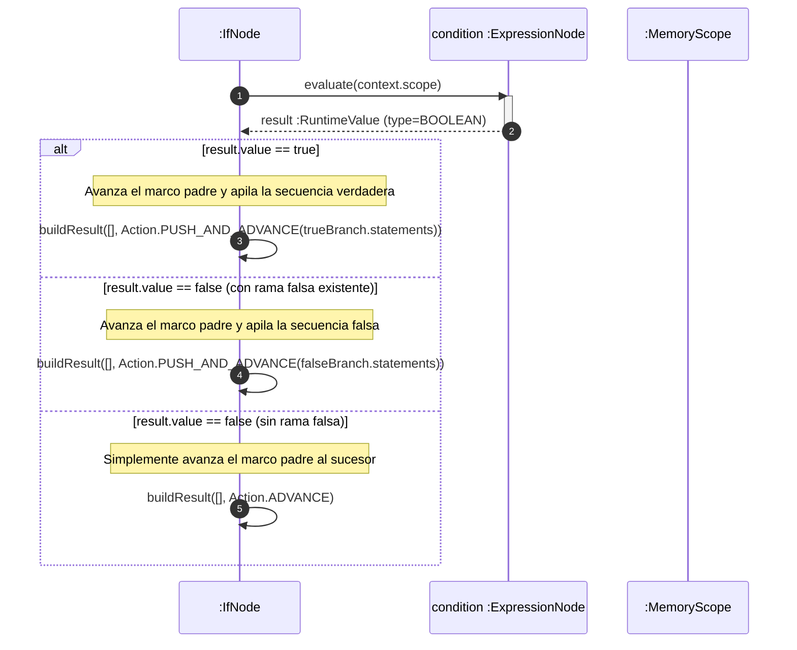
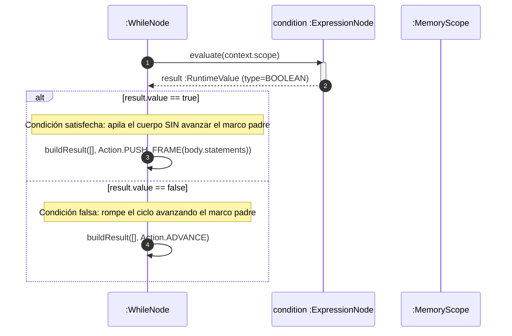
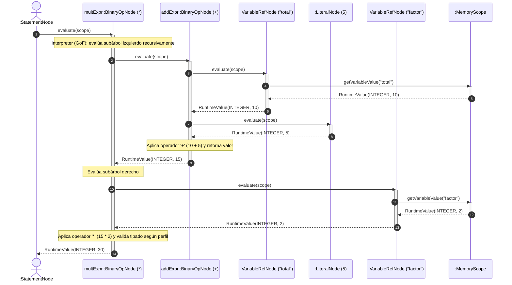
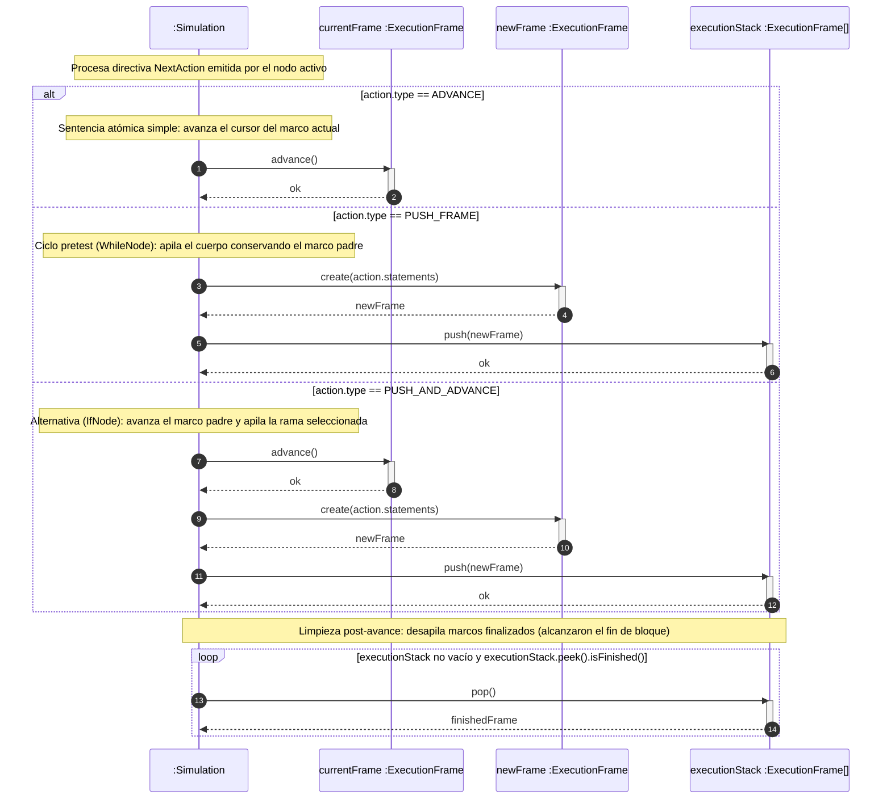
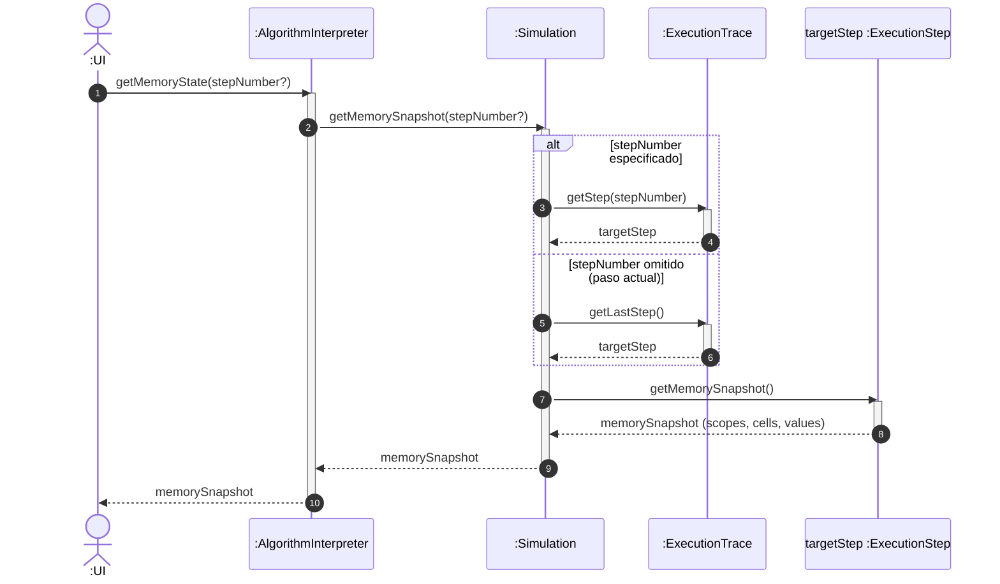
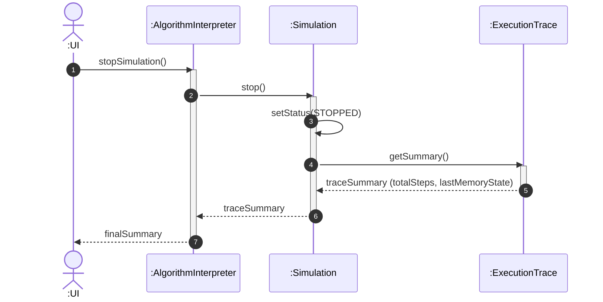

# Realizaciones de casos de uso: UC02

> **Versión:** `0.1.0`

## 1. Introducción y enfoque de diseño

Se modela la realización del escenario crítico **`UC02-BasicMemory`** en
**TypeScript**, aplicando el principio de separación modelo-vista y los patrones
de asignación de responsabilidades **GRASP** y **GoF**.

### Convención arquitectónica

- Las operaciones del sistema identificadas en el DSS (`startSimulation`,
  `executeNextStep`, `getMemoryState`, `stopSimulation`) ingresan a través del
  controlador de fachada de la capa de dominio (`AlgorithmInterpreter`).
- El árbol sintáctico (AST) es una estructura jerárquica estrictamente inmutable
  (_Composite_).
- El motor aplica un **intérprete con stepper explícito**:
  - Las expresiones aplican el patrón **Interpreter (GoF)** puro mediante
    `evaluate(scope)`.
  - Las sentencias aplican un **stepper explícito**: no ejecutan recursivamente
    a sus hijos, sino que devuelven una directiva `NextAction` (`ADVANCE`,
    `PUSH_FRAME`, `PUSH_AND_ADVANCE`). La clase coordinadora `Simulation`
    administra la **pila de marcos de ejecución** (`executionStack:
ExecutionFrame[]`) avanzando un paso observable a la vez.
- La capa de presentación (Vue.js) actúa exclusivamente como observador y emisor
  desacoplado; no contiene lógica algorítmica ni manipulación de memoria.
- Todas las clases, interfaces y métodos de diseño se nombran en inglés conforme
  a los estándares técnicos del proyecto.

### Trazabilidad

- Requisitos: [DSS UC02](../../02-requirements/ssd/uc02.md)
- Contratos: [Contratos de Operación
  UC02](../../02-requirements/operation-contracts/uc02.md) (CO1, CO2, CO3, CO4)
- Dominio: [Modelo de Dominio](../../01-business-modeling/domain-model.md)
- Diseño: [DCD Motor de Dominio](../design-class-diagrams/domain-engine.md)

## 2. Realización de `startSimulation(program, mode)` (CO1)

### 2.1 Diagrama de secuencia: `startSimulation`

### 2.2 Justificación y patrones aplicados

| Patrón / Principio               | Decisión de diseño y justificación                                                                                                                                                                                                         |
| :------------------------------- | :----------------------------------------------------------------------------------------------------------------------------------------------------------------------------------------------------------------------------------------- |
| **Controlador**                  | `AlgorithmInterpreter` es el objeto raíz de la capa de dominio que recibe la operación del sistema `startSimulation` desde la interfaz o el arnés de pruebas (Vitest), actuando como fachada del subsistema de ejecución.                  |
| **Creador**                      | `AlgorithmInterpreter` crea la instancia de `Simulation` porque la registra y gestiona su ciclo de vida. A su vez, `Simulation` crea el `MemoryScope` raíz y la `ExecutionTrace` porque contiene y administra agregadamente estos objetos. |
| **Bajo acoplamiento**            | La interfaz de usuario solo interactúa con el controlador `AlgorithmInterpreter` y recibe estructuras de datos de solo lectura (`ExecutionStep`), sin manipular la construcción interna del entorno de memoria ni del árbol sintáctico.    |
| **Bajo abismo representacional** | La clase `Simulation` mapea de forma directa la entidad conceptual `Simulacion` definida en el Modelo de Dominio.                                                                                                                          |

## 3. Realización de `executeNextStep()` (CO2)

Coordina la ejecución de la instrucción asociada al nodo del AST activo, delega
la evaluación y mutación de memoria, y actualiza el cursor de control.

### 3.1 Diagrama de secuencia principal: Coordinación del paso

### 3.2 Subdiagramas polimórficos de ejecución por nodo del AST

En conformidad con el principio de **Polimorfismo** (GRASP) y el enfoque de
**stepper explícito**, cada nodo concreto del AST es responsable de ejecutar su
propia semántica atómica sobre el contexto de ejecución recibido.

#### A. Realización de `AssignmentNode.execute(context)`

Modela la evaluación de una expresión y su asignación a una celda de memoria en
el ámbito vigente mediante la `SymbolTable`.

#### B. Realización de `IfNode.execute(context)`

Modela la evaluación de la condición lógica y la derivación de flujo hacia la
rama verdadera o falsa mediante `PUSH_AND_ADVANCE`.

#### C. Realización de `WhileNode.execute(context)`

Modela la iteración pretest según la semántica de contigüidad Nassi-Shneiderman.

#### D. Realización de evaluación recursiva de expresiones (`BinaryOpNode.evaluate`)

Modela la evaluación recursiva síncrona en el subárbol sintáctico de expresiones
aplicando el patrón **Interpreter (GoF)**. A modo de ejemplo representativo, se
detalla la resolución de la expresión compuesta `(total + 5) * factor`, donde el
nodo raíz de multiplicación delega recursivamente en sus subárboles izquierdo
(`BinaryOpNode(+)`) y derecho (`VariableRefNode("factor")`), interactuando con
el `MemoryScope` para la resolución de identificadores y constantes.

### 3.3 Subdiagrama de coordinación de pila: `Simulation.handleNextAction(action)`

Modela el comportamiento del motor de simulación al interpretar las directivas
`NextAction` (`ADVANCE`, `PUSH_FRAME`, `PUSH_AND_ADVANCE`) sobre la pila
`executionStack`, asegurando el avance atómico del cursor y la posterior
recolección de marcos completados.

### 3.4 Justificación y patrones aplicados (GRASP y GoF)

| Patrón / Principio                        | Decisión de diseño y justificación                                                                                                                                                                                                                                          |
| :---------------------------------------- | :-------------------------------------------------------------------------------------------------------------------------------------------------------------------------------------------------------------------------------------------------------------------------- |
| **Polimorfismo**                          | En lugar de utilizar bifurcaciones condicionales (`switch(node.type)`) en el controlador, la responsabilidad de ejecución se asigna polimórficamente a cada clase de nodo del AST (`AssignmentNode`, `IfNode`, `WhileNode`) mediante la operación común `execute(context)`. |
| **Patrón intérprete (expresiones)**       | Las expresiones matemáticas y lógicas evalúan sus subárboles de forma recursiva pura con `evaluate(scope)`.                                                                                                                                                                 |
| **Patrón stepper explícito (sentencias)** | Las sentencias no evalúan a sus hijos de forma monolítica, sino que emiten una acción de control (`NextAction`), permitiendo a `Simulation` manipular la pila `ExecutionFrame` y pausar entre instrucciones observables.                                                    |
| **Experto en información**                | `MemoryScope`, `SymbolTable` y `MemoryCell` poseen los datos y valores de las variables; por ende, asumen la responsabilidad de almacenar, actualizar y validar las asignaciones.                                                                                           |
| **Mapeo conceptual directo**              | `ExpressionNode` y los nodos del AST representan formalmente en software los conceptos `Expresión` y `Bloque` definidos en el Modelo de Dominio.                                                                                                                            |
| **Fabricación pura**                      | `MemoryScope`, `SymbolTable`, `ExecutionTrace` y `ExecutionContext` son clases artificiales creadas para mantener alta la cohesión de la lógica de memoria, aislamiento y traza histórica.                                                                                  |
| **Alta cohesión**                         | `Simulation` se enfoca en coordinar la secuencia de pasos y la traza global, delegando la semántica particular de cómputo a los nodos y a las estructuras de memoria.                                                                                                       |

## 4. Realización de `getMemoryState(stepNumber?)` (CO3)

Operación de consulta pura que cumple con el principio de separación
comando-consulta (**CQS**) y garantiza la separación modelo-vista.

### 4.1 Diagrama de secuencia: `getMemoryState`

### 4.2 Justificación y patrones aplicados (GRASP)

| Patrón / Principio                    | Decisión de diseño y justificación                                                                                                                                  |
| :------------------------------------ | :------------------------------------------------------------------------------------------------------------------------------------------------------------------ |
| **Separación comando-consulta (CQS)** | `getMemoryState` no produce efectos colaterales: no altera el valor de ninguna variable, no incrementa el número de paso ni modifica el estado de la simulación.    |
| **Experto en información**            | `ExecutionTrace` conoce la colección histórica de pasos registrados; `ExecutionStep` conoce el estado de la memoria en ese instante determinado.                    |
| **Protección frente a variaciones**   | Se retorna una copia estructurada e inmutable de la memoria (_snapshot_), impidiendo que capas externas modifiquen accidentalmente las celdas de ejecución activas. |

## 5. Realización de `stopSimulation()` (CO4)

Modela la interrupción controlada de la ejecución activa.

### 5.1 Diagrama de secuencia: `stopSimulation`

### 5.2 Justificación y patrones aplicados (GRASP)

| Patrón / Principio         | Decisión de diseño y justificación                                                                                                                                                                          |
| :------------------------- | :---------------------------------------------------------------------------------------------------------------------------------------------------------------------------------------------------------- |
| **Controlador**            | `AlgorithmInterpreter` canaliza la solicitud de parada proveniente del usuario.                                                                                                                             |
| **Experto en información** | `Simulation` conoce su propio estado de ciclo de vida y coordina la transición hacia el estado `STOPPED`, preservando intacta la traza histórica para auditoría o visualización en la prueba de escritorio. |
