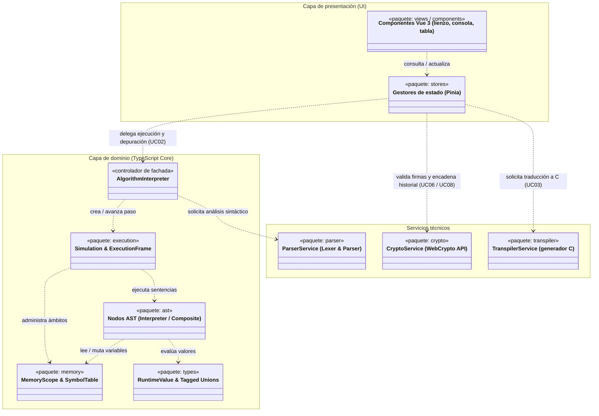

# Documento de arquitectura de software

> **Versión:** `0.1.0`

## 1. Representación arquitectónica

Este documento describe la arquitectura de **Diagramar PWA** utilizando el
modelo de vistas **N+1**, documentando los requerimientos arquitectónicamente
significativos, las decisiones técnicas adoptadas y la organización lógica del
sistema.

## 2. Factores arquitectónicos

Los requisitos no funcionales y restricciones del sistema se detallan en la
[especificación suplementaria (§ 2 y § 9)](../02-requirements/supp-spec.md). Los
principales factores que gobiernan las decisiones de este documento son:

- **Separación modelo-vista:** Desacoplamiento total entre el motor algorítmico
  y la interfaz de usuario.
- **Pausabilidad e inspección de memoria:** Capacidad de ejecutar paso a paso
  sin bloquear el navegador.
- **Inferencia de tipos y soporte multilenguaje:** Soporte simultáneo de
  transpilación estática a C y perfiles dinámicos.
- **Autonomía _client-side_:** Operación completa fuera de línea (PWA) sin
  servidor central.
- **Integridad académica:** Verificación criptográfica de consignas y
  trazabilidad de resolución.

## 3. Decisiones arquitectónicas

Las decisiones estructurales se encuentran formalizadas en memorandos técnicos
independientes:

- [**TM-01: Aislamiento del motor lógico y separación
  modelo-vista**](technical-memos/tm-01-model-view-separation.md)  
  Define el desacoplamiento de la capa de dominio en TypeScript puro y el rol
  del controlador `AlgorithmInterpreter`.
- [**TM-02: Modelo de ejecución y representación de
  memoria**](technical-memos/tm-02-memory-and-execution-model.md)  
  Define el patrón Interpreter para expresiones, el _stepper_ explícito con pila
  de marcos para sentencias y el esquema de _tagged unions_ para celdas de
  memoria.
- [**TM-03: Integridad y auditoría en
  cliente**](technical-memos/tm-03-client-side-integrity.md)  
  Define el reemplazo de HMAC por firmas asimétricas con WebCrypto API y el
  historial encadenado (_hash-chain_).

## 4. Vista lógica

La arquitectura sigue una organización en capas relajada (_relaxed layered
architecture_):

Para el detalle de métodos, atributos y contratos de la capa de dominio,
consultar el [DCD del motor de dominio](design-class-diagrams/domain-engine.md).
Para las trazas de colaboración dinámica, consultar las [realizaciones de casos
de uso UC02](interaction-diagrams/uc02.md).

## 5. Vista de casos de uso

1. **[UC02: Ejecutar y depurar algoritmo](../02-requirements/use-cases/uc02.md)
   (Escenario `BasicMemory`):** Valida la interacción entre el controlador
   `AlgorithmInterpreter`, los nodos del AST y las estructuras de memoria.
2. **[UC06: Resolver tarea
   evaluable](../02-requirements/use-cases/brief-use-cases.md#uc06-resolver-tarea-evaluable):**
   Valida el contexto de evaluación, el oráculo de pruebas y el registro
   criptográfico de eventos.
