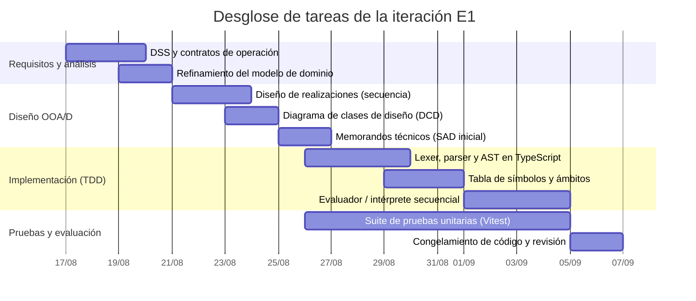

# Plan de iteración

> **Versión:** `0.1.0`  
> **Fase:** Elaboración  
> **Iteración:** E1  
> **Período (_timebox_):** 17/08/2026 al 06/09/2026 (3 semanas fijas)

## 1. Resumen y objetivos de la iteración

Conforme a la metodología del Proceso Unificado Ágil propuesta por Craig Larman,
la primera iteración de la fase de Elaboración no tiene como objetivo construir
pantallas superficiales, sino **mitigar tempranamente la mayor incertidumbre
técnica y construir el núcleo de la arquitectura ejecutable (_architectural
baseline_)**.

En esta iteración se aborda el riesgo crítico
[**R1**](../risk-list.md#2-matriz-de-evaluación-y-mitigación-de-riesgos)
(_complejidad del analizador léxico-sintáctico y del intérprete paso a paso_),
implementando en **TypeScript puro** la capa de dominio desacoplada de la
interfaz gráfica, guiada por el **principio de separación modelo-vista**.

### Objetivos clave de E1

1. **Mitigación del [riesgo
   R1](../risk-list.md#2-matriz-de-evaluación-y-mitigación-de-riesgos):**
   Diseñar y construir el analizador léxico-sintáctico (_parser_), el árbol de
   sintaxis abstracta (AST) y la tabla de símbolos para un subconjunto
   representativo del lenguaje algorítmico.
2. **Implementación del núcleo de ejecución en memoria:** Desarrollar el motor
   de interpretación secuencial en memoria aplicando el patrón de diseño
   _Interpreter_ y patrones GRASP.
3. **Desarrollo guiado por pruebas (TDD):** Validar la totalidad de la lógica de
   evaluación y ámbitos de memoria mediante una suite automatizada de pruebas
   unitarias en **Vitest**.
4. **Inicio del modelo de diseño y del SAD:** Elaborar los diagramas de
   interacción y diagramas de clases de diseño (DCD) para las realizaciones de
   casos de uso seleccionadas, e iniciar el documento de arquitectura de
   software ([SAD](../../03-design/sad.md)).

## 2. Presupuesto de recursos y capacidad operativa

La duración de la iteración se rige bajo la práctica estricta de **caja de
tiempo (_timeboxing_)**: la fecha de finalización (06/09/2026) es inamovible.

- **Capacidad semanal disponible:** 12 horas promedio de trabajo neto.
- **Capacidad total de la iteración (3 semanas):** ~36 horas hombre.
- **Distribución temporal:**
  - _Semana 1 (17/08 – 23/08):_ Requisitos, modelado OOA/D preliminar y diseño
    del AST / parser (~12 hs).
  - _Semana 2 (24/08 – 30/08):_ Construcción TDD del motor de tipos, expresiones
    y tabla de símbolos (~12 hs).
  - _Semana 3 (31/08 – 06/09):_ Intérprete secuencial, integración de pruebas,
    estabilización de línea base (_freeze_) y evaluación (~12 hs).

## 3. Requerimientos y escenarios seleccionados

En consonancia con la estrategia _use-case driven_ de Larman, el trabajo de la
iteración se define por un subconjunto acotado de escenarios del caso de uso
crítico:

| Caso de uso                                                                                                  | Escenario / requerimiento seleccionado                                                                                                                  | Prioridad | Justificación arquitectónica                                                                            |
| :----------------------------------------------------------------------------------------------------------- | :------------------------------------------------------------------------------------------------------------------------------------------------------ | :-------: | :------------------------------------------------------------------------------------------------------ |
| [**UC02: Ejecutar y depurar algoritmo**](../../02-requirements/use-cases/uc02.md)                            | **Escenario UC02-BasicMemory:** Ejecución secuencial en memoria de asignaciones, expresiones aritméticas/lógicas y bifurcaciones condicionales simples. | **Alta**  | Fuerza la definición del AST, la tabla de símbolos y el evaluador de expresiones sin depender de la UI. |
| [**Reglas de dominio**](../../02-requirements/supp-spec.md#9-reglas-de-dominio) (RULE-01 a RULE-03, RULE-11) | Análisis léxico-sintáctico de operadores aritméticos, relacionales y lógicos según convención estándar y perfil legado 2009.                            | **Alta**  | Define la gramática formal y el sistema de tipos escalares (`INTEGER`, `REAL`, `BOOLEAN`, `STRING`).    |
| [**Requerimientos no funcionales (FURPS+)**](../../02-requirements/supp-spec.md)                             | Autonomía de ejecución en cliente, independencia de frameworks (separación modelo-vista) y tiempos de evaluación < 5 ms por instrucción.                | **Media** | Valida la viabilidad técnica y performance del motor en TypeScript puro.                                |

_Nota:_ Se postergan para iteraciones posteriores (E2 y Construcción) los
escenarios complejos de UC02 tales como: subprogramas con pasaje de parámetros
por referencia, estructuras de datos dinámicas (punteros), retroceso de pasos
(_step-back_) y renderizado geométrico visual en Vue.js.

## 4. Desglose de tareas por disciplina del Proceso Unificado

### 4.1 Disciplina: Requisitos y análisis

- **REQ-E1.1:** Elaborar el diagrama de secuencia del sistema
  ([DSS](../../02-requirements/ssd/uc02.md)) para el escenario básico de
  ejecución en memoria de [**UC02**](../../02-requirements/use-cases/uc02.md).
  _(2.0 hs)_
- **REQ-E1.2:** Especificar los [contratos de
  operación](../../02-requirements/operation-contracts/uc02.md) para las
  operaciones del sistema: `startSimulation()`, `executeNextStep()` y
  `getMemoryState()`. _(2.5 hs)_
- **REQ-E1.3:** Refinar los conceptos de _ámbito de memoria_, _celda de memoria_
  y _valor escalar_ en el [modelo de
  dominio](../../01-business-modeling/domain-model.md) conceptual. _(1.5 hs)_

### 4.2 Disciplina: Diseño orientado a objetos (OOA/D)

- **DES-E1.1:** Diseñar las [realizaciones de casos de
  uso](../../03-design/interaction-diagrams/uc02.md) mediante diagramas de
  interacción (secuencia) aplicando **GRASP** (_Information Expert_, _Creator_,
  _Controller_, _Pure Fabrication_). _(4.0 hs)_
- **DES-E1.2:** Diseñar la estructura del AST aplicando el patrón de diseño
  **Interpreter** (GoF) y modelar el [diagrama de clases de diseño
  (DCD)](../../03-design/design-class-diagrams/domain-engine.md) de la capa de
  dominio. _(3.5 hs)_
- **DES-E1.3:** Redactar los memorandos técnicos iniciales en el documento de
  arquitectura de software ([SAD](../../03-design/sad.md)): decisiones sobre
  representación de memoria (_tagged unions_) y aislamiento del motor lógico.
  _(2.0 hs)_

### 4.3 Disciplina: Implementación (núcleo TypeScript)

- **IMP-E1.1:** Construir el analizador léxico (_lexer_) y sintáctico (_parser_)
  recursivo descendente para expresiones aritméticas y booleanas. _(4.0 hs)_
- **IMP-E1.2:** Implementar la jerarquía de clases y nodos del AST
  (`AssignmentNode`, `IfNode`, `WhileNode`, `ExpressionNode`). _(3.5 hs)_
- **IMP-E1.3:** Implementar la `SymbolTable`, `MemoryScope` y las estructuras de
  valores en tiempo de ejecución (`RuntimeValue`). _(3.0 hs)_
- **IMP-E1.4:** Implementar la clase controladora del dominio
  `AlgorithmInterpreter` que coordina la ejecución secuencial en memoria. _(3.0
  hs)_

### 4.4 Disciplina: Pruebas (TDD)

- **TST-E1.1:** Configurar el arnés de pruebas unitarias automatizadas con
  Vitest. _(1.0 hs)_
- **TST-E1.2:** Crear suite de pruebas unitarias TDD para validación de
  expresiones y detección de errores sintácticos/semánticos (división por cero,
  tipos incompatibles). _(3.0 hs)_
- **TST-E1.3:** Crear suite de pruebas de integración en memoria para algoritmos
  clásicos de control (condicionales y bucles mientras). _(2.0 hs)_

### 4.5 Disciplina: Gestión y entorno

- **MGT-E1.1:** Seguimiento semanal del tablero Kanban y ajuste de estimaciones.
  _(1.0 hs)_
- **MGT-E1.2:** Cierre de iteración, congelamiento de línea base (_code freeze_)
  y etiquetado en Git (`v0.2.0-e1`). _(1.0 hs)_

## 5. Estimación de esfuerzo consolidada

| Disciplina UP           | Tareas asociadas                       | Esfuerzo estimado (horas) | Proporción |
| :---------------------- | :------------------------------------- | :-----------------------: | :--------: |
| **Requisitos**          | REQ-E1.1, REQ-E1.2, REQ-E1.3           |          6.0 hs           |   16.2%    |
| **Diseño**              | DES-E1.1, DES-E1.2, DES-E1.3           |          9.5 hs           |   25.7%    |
| **Implementación**      | IMP-E1.1, IMP-E1.2, IMP-E1.3, IMP-E1.4 |          13.5 hs          |   36.5%    |
| **Pruebas (TDD)**       | TST-E1.1, TST-E1.2, TST-E1.3           |          6.0 hs           |   16.2%    |
| **Gestión y entorno**   | MGT-E1.1, MGT-E1.2                     |          2.0 hs           |    5.4%    |
| **Total presupuestado** |                                        |        **37.0 hs**        |  **100%**  |

## 6. Guía de adaptación y descarte (criterios de recorte)

Siguiendo el principio de Larman: _«El deslizamiento de fechas es ilegal; la
respuesta recomendada ante retrasos es recortar alcance (de-scope)»_.

Si al promediar la semana 2 se detecta un desvío que comprometa el cierre del
_timebox_ al 06/09/2026, se aplicarán las siguientes prioridades de recorte:

1. **Elementos no descartables (núcleo crítico):**
   - Parser y AST de asignaciones y operaciones aritméticas básicas.
   - Tabla de símbolos básica y asignación de variables escalares en memoria.
   - Suite de pruebas unitarias automatizadas con Vitest pasando al 100%.
2. **Candidatos primarios a descarte (pospuestos a E2):**
   - Soporte de ciclos `ForNode` y `RepeatUntilNode` en el parser (mantener solo
     `WhileNode`).
   - Funciones predefinidas complejas (`RAIZ`, `TRUNC`).
   - Manejo de arreglos unidimensionales (listas) en memoria.

## 7. Criterios de evaluación y demostración de la línea base

Al finalizar la iteración (06/09/2026), el incremento no será un prototipo
descartable, sino una **porción de código de calidad de producción
(_production-grade subset_)** que formará parte permanente del sistema.

### Criterios de aceptación técnica

1. **Verificación automatizada:** La suite de pruebas de Vitest ejecuta y
   aprueba el 100% de los tests unitarios sin fallas (_green bar_).
2. **Demostración ejecutable:** Un script de prueba ejecuta con éxito un
   algoritmo estructurado (con variables, condiciones y bucles mientras)
   instanciado en el AST en memoria, imprimiendo la traza completa de la memoria
   paso a paso en consola.
3. **Trazabilidad documental:** Los diagramas de interacción y el DCD reflejan
   fielmente las clases y métodos creados en el código TypeScript
   (`AlgorithmInterpreter`, `Parser`, `SymbolTable`, `ASTNode`).
4. **Línea base congelada:** Repositorio etiquetado formalmente con el tag
   `v0.2.0-e1`.
