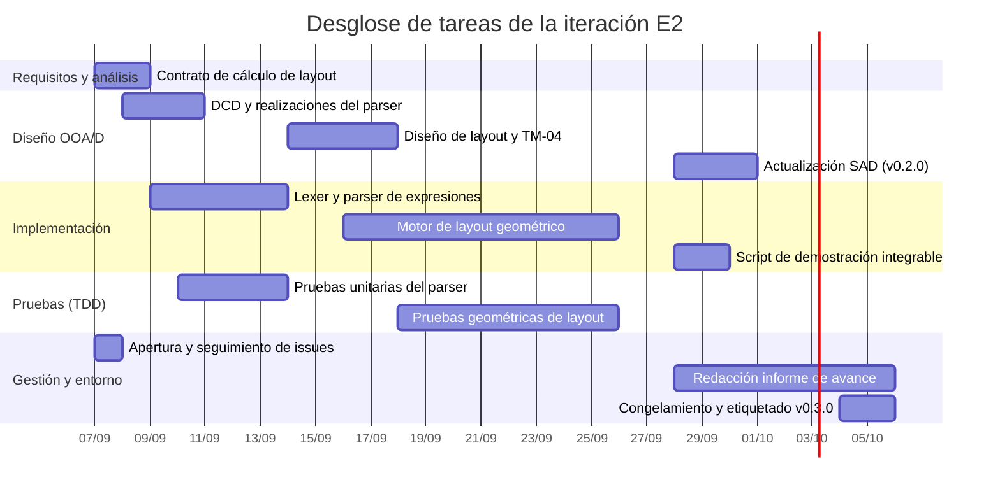

# Plan de iteración

> **Versión:** `0.1.0`  
> **Fase:** Elaboración  
> **Iteración:** E2  
> **Período (_timebox_):** 07/09/2026 al 05/10/2026 (4 semanas fijas)

## 1. Resumen y objetivos de la iteración

Conforme a la metodología del Proceso Unificado Ágil propuesta por Craig Larman,
la segunda iteración de la fase de Elaboración tiene como propósito completar la
**línea base arquitectónica ejecutable** y sustentar la presentación formal del
**informe de avance**.

Durante la iteración E1 se consolidó el núcleo de ejecución en memoria de
[**UC02**](../../02-requirements/use-cases/uc02.md) (árbol de sintaxis abstracta
de sentencias, sistema de tipos escalares con _tagged unions_, tabla de símbolos
e intérprete secuencial), verificado integralmente mediante pruebas unitarias en
Vitest. En esta segunda iteración se aborda la mitigación residual del riesgo
crítico [**R1**](../risk-list.md#2-matriz-de-evaluación-y-mitigación-de-riesgos)
mediante la construcción del analizador léxico y sintáctico de expresiones
(`IMP-E1.1`, issue [#7](https://github.com/CrysoK/DiagramarPWA/issues/7)), lo
que permitirá evaluar de forma dinámica las expresiones aritméticas,
relacionales y lógicas asignadas o evaluadas en las estructuras de control.

El objetivo rector de la iteración consiste en mitigar el riesgo
[**R2**](../risk-list.md#2-matriz-de-evaluación-y-mitigación-de-riesgos)
(_cálculo geométrico recursivo N-S_). Se diseñará e implementará en TypeScript
puro el algoritmo de dimensionamiento y posicionamiento relativo (_layout
top-down_) para estructogramas Nassi-Shneiderman, garantizando un estricto
desacoplamiento respecto de cualquier tecnología de interfaz gráfica o
renderizado.

### Objetivos clave de E2

1. **Mitigación residual del [riesgo
   R1](../risk-list.md#2-matriz-de-evaluación-y-mitigación-de-riesgos):**
   Diseñar y construir el analizador léxico (_lexer_) y sintáctico (_parser_)
   recursivo descendente para expresiones escalares, vinculándolo con los nodos
   `ExpressionNode` del AST desarrollado en E1.
2. **Mitigación del [riesgo
   R2](../risk-list.md#2-matriz-de-evaluación-y-mitigación-de-riesgos):**
   Diseñar e implementar en TypeScript puro el motor de cálculo geométrico
   recursivo (`LayoutEngine`) para los bloques de estructograma soportados
   (`SequenceNode`, `IfNode`, `WhileNode`), validando el recálculo jerárquico
   ante anidamiento arbitrario.
3. **Integración y demostración de la línea base arquitectónica:** Consolidar un
   escenario de prueba ejecutable que integre el análisis sintáctico de
   expresiones, la interpretación paso a paso en memoria y la generación del
   árbol de cajas geométricas (`LayoutBox`), verificado mediante pruebas
   automatizadas en Vitest.
4. **Actualización del SAD y elaboración del informe de avance:** Formalizar las
   decisiones de diseño en la versión `0.2.0` del [Documento de Arquitectura de
   Software (SAD)](../../03-design/sad.md) y redactar el informe de avance
   conforme a las pautas metodológicas de la cátedra de Seminario de Sistemas.

## 2. Presupuesto de recursos y capacidad operativa

La duración de la iteración se rige bajo la práctica estricta de **caja de
tiempo (_timeboxing_)**: la fecha de finalización (05/10/2026) es inamovible,
debiendo presentarse el informe de avance el 06/10/2026.

En conformidad con el riesgo
[**R4**](../risk-list.md#2-matriz-de-evaluación-y-mitigación-de-riesgos), la
capacidad operativa contempla las restricciones del calendario académico (turno
de examen final el 22/09/2026) y el esfuerzo requerido para la elaboración del
informe académico:

- **Capacidad semanal promedio:** 9.5 horas de trabajo neto.
- **Capacidad total de la iteración (4 semanas):** ~38 horas hombre.
- **Distribución temporal:**
  - _Semana 1 (07/09 – 13/09):_ Diseño e implementación del analizador léxico y
    sintáctico de expresiones con TDD (~12 hs).
  - _Semana 2 (14/09 – 20/09):_ Especificación de contratos, diseño OOA/D e
    inicio del motor de _layout_ geométrico (~8 hs).
  - _Semana 3 (21/09 – 27/09):_ Dedicación reducida por turno de examen final
    (22/09); finalización y pruebas del algoritmo de _layout_ (~6 hs).
  - _Semana 4 (28/09 – 05/10):_ Integración de la demostración ejecutable,
    actualización del SAD (`0.2.0`), redacción del informe de avance y
    congelamiento de línea base (~12 hs).

## 3. Requerimientos y escenarios seleccionados

Siguiendo la estrategia orientada por casos de uso (_use-case driven_), el
trabajo se enfoca en los requerimientos del dominio necesarios para completar la
arquitectura ejecutable:

| Caso de uso                                                                                                          | Escenario / requerimiento seleccionado                                                                                                                                                    | Prioridad | Justificación arquitectónica                                                                                                                 |
| :------------------------------------------------------------------------------------------------------------------- | :---------------------------------------------------------------------------------------------------------------------------------------------------------------------------------------- | :-------: | :------------------------------------------------------------------------------------------------------------------------------------------- |
| [**UC02: Ejecutar y depurar algoritmo**](../../02-requirements/use-cases/uc02.md)                                    | **Análisis sintáctico de expresiones:** Interpretación de expresiones aritméticas, relacionales y lógicas contenidas en sentencias de asignación y condiciones de estructuras de control. | **Alta**  | Mitiga el remanente de R1 al integrar el análisis dinámico de expresiones con la evaluación en memoria y el despacho de pasos ya existentes. |
| [**UC01: Construir algoritmo N-S**](../../02-requirements/use-cases/brief-use-cases.md#uc01-construir-algoritmo-n-s) | **Cálculo geométrico recursivo:** Determinación de dimensiones y coordenadas relativas (_layout top-down_) para secuencias, bifurcaciones condicionales y bucles mientras.                | **Alta**  | Mitiga R2 al validar matemáticamente el algoritmo de dimensionamiento jerárquico antes de implementar la interfaz gráfica.                   |
| [**Requerimientos no funcionales (FURPS+)**](../../02-requirements/supp-spec.md)                                     | Independencia de frameworks (separación modelo-vista), modularidad de la capa de dominio y recálculo determinístico ante anidamiento arbitrario.                                          | **Media** | Asegura la portabilidad y verificabilidad de la lógica geométrica en TypeScript puro sin dependencias del DOM ni tecnologías de renderizado. |

El caso de uso
[**UC01**](../../02-requirements/use-cases/brief-use-cases.md#uc01-construir-algoritmo-n-s)
se mantiene en formato resumido (_brief_), dado que la interacción visual
directa (manipulación interactiva sobre el lienzo, arrastre y acoplamiento de
bloques) corresponde a la fase de Construcción (C1). En E2 se aborda
exclusivamente el motor de cálculo geométrico subyacente.

_Nota:_ Se postergan para la fase de Construcción los componentes de interfaz en
Vue.js, el lienzo interactivo, los bloques de entrada/salida e invocación de
subprogramas, el modo de ejecución continua, el retroceso de pasos
(_step-back_), el soporte del perfil léxico _Diagramar 2009_, las estructuras
iterativas complementarias (`ForNode`, `RepeatUntilNode`), funciones
predefinidas y el soporte de arreglos.

## 4. Desglose de tareas por disciplina del Proceso Unificado

### 4.1 Disciplina: Requisitos y análisis

- **REQ-E2.1:** Especificar el contrato de operación para el cálculo de
  dimensionamiento geométrico del algoritmo (`computeLayout`), estableciendo sus
  precondiciones y poscondiciones formales sobre el árbol sintáctico. _(1.5 hs)_

### 4.2 Disciplina: Diseño orientado a objetos (OOA/D)

- **DES-E2.1:** Extender el [diagrama de clases de diseño
  (DCD)](../../03-design/design-class-diagrams/domain-engine.md) con las clases
  `Lexer` y `Parser` de expresiones, modelando las realizaciones de caso de uso
  mediante diagramas de interacción. _(2.5 hs)_
- **DES-E2.2:** Diseñar el modelo de clases para el cálculo geométrico
  (`LayoutEngine`, `LayoutBox`, métricas espaciales) y elaborar el memorando
  técnico TM-04 sobre el algoritmo recursivo _top-down_ desacoplado de la vista.
  _(3.5 hs)_
- **DES-E2.3:** Actualizar el [Documento de Arquitectura de Software
  (SAD)](../../03-design/sad.md) a la versión `0.2.0`, documentando la
  incorporación del analizador sintáctico y el módulo de _layout_. _(2.0 hs)_

### 4.3 Disciplina: Implementación (núcleo TypeScript)

- **IMP-E2.1:** Implementar el analizador léxico (`Lexer`) y el parser recursivo
  descendente (`Parser`) para expresiones del perfil Estándar/C, resolviendo la
  precedencia de operadores y la instanciación de nodos `ExpressionNode`
  (asociado al issue [#7](https://github.com/CrysoK/DiagramarPWA/issues/7)).
  _(7.0 hs)_
- **IMP-E2.2:** Implementar `LayoutEngine` en el paquete de dominio
  (`src/domain/layout/`), transformando la estructura jerárquica del AST en un
  árbol posicional de nodos `LayoutBox` con dimensiones y coordenadas relativas.
  _(7.0 hs)_
- **IMP-E2.3:** Construir un script de demostración ejecutable que integre la
  lectura de expresiones, la ejecución secuencial en memoria y la emisión del
  árbol geométrico resultante. _(2.0 hs)_

### 4.4 Disciplina: Pruebas (TDD)

- **TST-E2.1:** Desarrollar suite de pruebas unitarias automatizadas en Vitest
  para el analizador de expresiones (análisis léxico, sintaxis válida,
  precedencia de operadores y captura de errores de análisis). _(2.5 hs)_
- **TST-E2.2:** Desarrollar suite de pruebas automatizadas para el cálculo
  geométrico, validando dimensiones y coordenadas en estructuras de control
  simples y anidadas (secuencias, alternativas con ramas vacías y bucles). _(2.5
  hs)_

### 4.5 Disciplina: Gestión y entorno

- **MGT-E2.1:** Configuración inicial del tablero de la iteración y seguimiento
  de tareas en GitHub Projects. _(1.0 hs)_
- **MGT-E2.2:** Cierre de iteración, congelamiento de código (_code freeze_) y
  etiquetado formal de la versión en Git (`v0.3.0-e2`). _(1.0 hs)_
- **MGT-E2.3:** Redacción y revisión del informe de avance según los estándares
  formales de la cátedra de Seminario de Sistemas. _(5.5 hs)_

## 5. Estimación de esfuerzo consolidada

| Disciplina UP             | Tareas asociadas             | Esfuerzo estimado (horas) | Proporción |
| :------------------------ | :--------------------------- | :-----------------------: | :--------: |
| **Requisitos y análisis** | REQ-E2.1                     |          1.5 hs           |    3.9%    |
| **Diseño OOA/D**          | DES-E2.1, DES-E2.2, DES-E2.3 |          8.0 hs           |   21.1%    |
| **Implementación**        | IMP-E2.1, IMP-E2.2, IMP-E2.3 |          16.0 hs          |   42.1%    |
| **Pruebas (TDD)**         | TST-E2.1, TST-E2.2           |          5.0 hs           |   13.2%    |
| **Gestión y entorno**     | MGT-E2.1, MGT-E2.2, MGT-E2.3 |          7.5 hs           |   19.7%    |
| **Total presupuestado**   |                              |        **38.0 hs**        |  **100%**  |

El presupuesto contempla margen operativo en el modelado complementario ante
eventuales desvíos temporales, preservando la fecha límite del informe de avance
y la cobertura de pruebas requerida.

## 6. Guía de adaptación y descarte (criterios de recorte)

Siguiendo el principio de Larman: _«El deslizamiento de fechas es ilegal; la
respuesta recomendada ante retrasos es recortar alcance (de-scope)»_.

Si hacia el promediar la semana 2 (20/09/2026) se identifica un desvío que
amenace el cumplimiento del _timebox_, se aplicará la siguiente jerarquía de
prioridades:

1. **Elementos no descartables (núcleo crítico de la línea base):**
   - Analizador léxico y sintáctico de expresiones para operadores del perfil
     Estándar/C soportados por el AST.
   - Cálculo geométrico recursivo básico (`LayoutEngine`) en TypeScript puro con
     pruebas automatizadas satisfactorias.
   - Redacción y entrega del informe de avance.
   - Congelamiento formal y etiquetado de la versión (`v0.3.0-e2`).
2. **Criterios de mitigación y contingencia:**
   - Si el analizador de expresiones experimentara demoras críticas hacia el
     20/09/2026, se acotará su gramática a operaciones aritméticas y
     relacionales directas, admitiendo la instanciación programática en el AST
     para expresiones complejas en la demostración ejecutable, preservando
     intacto el tiempo presupuestado para el cálculo geométrico recursivo del
     _layout_ (R2).
   - Si el motor de _layout_ presentara dificultades en la resolución
     geométrica, se priorizará la correcta recursión sobre secuencias,
     bifurcaciones condicionales estándar y bucles, postergando el tratamiento
     de casos de borde visuales (como ramas condicionales vacías) para
     Construcción.
   - Las solicitudes de cambio o requerimientos emergentes no contemplados en
     los objetivos críticos de E2 serán derivados al _backlog_ general para su
     análisis durante la fase de Construcción.

## 7. Criterios de evaluación y demostración de la línea base

Al concluir la iteración (05/10/2026), el incremento constituirá una **porción
de código de calidad de producción (_production-grade subset_)** integrada a la
línea base arquitectónica ejecutable.

### Criterios de aceptación técnica

1. **Verificación automatizada:** La suite de pruebas de Vitest ejecuta y
   aprueba el 100% de los tests unitarios y de integración de la capa de dominio
   sin fallas.
2. **Demostración ejecutable:** Un script de consola ejecuta un estructograma
   representativo, procesa sintácticamente las expresiones de cada bloque,
   ejecuta el algoritmo paso a paso actualizando la memoria y genera la
   estructura jerárquica de cajas (`LayoutBox`), comprobando la operatividad del
   núcleo lógico y geométrico sin capas visuales.
3. **Trazabilidad documental:** Los artefactos de diseño (DCD del motor de
   dominio y SAD versión `0.2.0`) reflejan con precisión la estructura de clases
   y colaboraciones implementadas.
4. **Informe de avance formal:** Documento técnico y académico finalizado y
   listo para su presentación institucional el 06/10/2026.
5. **Línea base congelada:** Repositorio debidamente congelado y etiquetado con
   el tag Git formal `v0.3.0-e2`.
