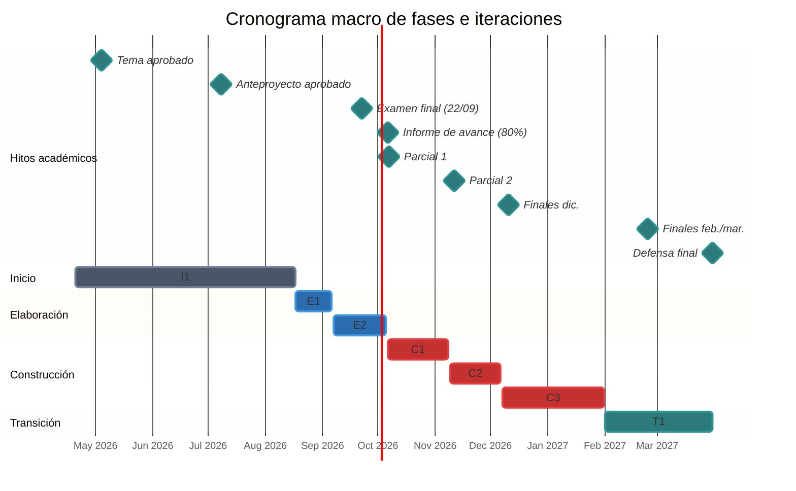

# Plan de fase

> **Versión:** `0.1.0`

## 1. Introducción y capacidad operativa

Este documento establece la planificación macroestructural a largo plazo de
**Diagramar PWA** conforme al Proceso Unificado (UP). La planificación es
**adaptativa**: define los hitos principales, la delimitación de fases, la
duración de las iteraciones (_timeboxes_) y la asignación general de requisitos
y riesgos, reservando el detalle operativo para el plan de cada iteración.

### 1.1 Restricciones y capacidad de dedicación

El proyecto es de desarrollo unipersonal a tiempo parcial y se coordina con las
siguientes obligaciones:

- **Jornada laboral:** 20 horas semanales.
- **Cursado universitario:** 9 horas semanales.
- **Dedicación efectiva al proyecto:** Promedio de 8 a 14 horas semanales de
  trabajo neto (~400 horas totales proyectadas).
- **Ventanas de dedicación reducida:** La disponibilidad horaria disminuye
  temporalmente durante las siguientes instancias de evaluación:
  - _Exámenes parciales de cursado:_ 07/10/2026 y 11/11/2026 (dedicación
    reducida 1 a 2 semanas previas).
  - _Turnos de exámenes finales:_ 22/09/2026, 03–04/12/2026, 16–18/12/2026,
    15–17/02/2027 y 03–05/03/2027 (dedicación reducida 2 a 3 semanas previas a
    cada llamado).

### 1.2 Transición metodológica

La fase de Inicio se extendió desde abril hasta mediados de agosto de 2026 para
absorber los tiempos de aprobación institucional y consolidar los requisitos
preliminares y el esquema de seguridad. A partir de Elaboración, se aplica la
práctica estricta de _timeboxing_: las fechas de cierre se mantienen fijas y
cualquier desvío se compensa ajustando el alcance (_de-scoping_).

## 2. Hitos principales del proyecto

| Hito                             | Fecha orientativa | Fecha programada | Estado / Entregable                                                                                                                                                                               |
| :------------------------------- | :---------------: | :--------------: | :------------------------------------------------------------------------------------------------------------------------------------------------------------------------------------------------ |
| **Presentación de tema**         |    22/04/2026     |    20/04/2026    | Aprobado por la Comisión (04/05/2026).                                                                                                                                                            |
| **Presentación de anteproyecto** |    03/06/2026     |    24/06/2026    | Aprobado por la Comisión (08/07/2026).                                                                                                                                                            |
| **Cierre de fase de Inicio**     |         —         |    17/08/2026    | Visión, casos de uso _brief_, caso de uso crítico _fully dressed_ (UC02), especificación suplementaria, glosario, modelo de dominio, lista de riesgos, caso de desarrollo y plan de iteración E1. |
| **Informe de avance (80%)**      |    06/10/2026     |    06/10/2026    | Núcleo ejecutable base probado (AST, parser, intérprete y layout N-S) y SAD preliminar.                                                                                                           |
| **Cierre de Construcción**       |         —         |    31/01/2027    | PWA completamente funcional, instalable y operativa fuera de línea.                                                                                                                               |
| **Informe final y defensa**      |     Feb. 2027     | Marzo/Abril 2027 | Documento final presentado y defensa oral del Seminario de Sistemas.                                                                                                                              |

## 3. Cronograma macro de fases e iteraciones

### 3.1 Fase de Inicio (Inception)

- **Período:** 20/04/2026 al 17/08/2026 (17 semanas).
- **Esfuerzo neto:** ~60 horas.
- **Objetivos alcanzados:** Delimitación del alcance, viabilidad, selección
  tecnológica, análisis de riesgos, caso de uso crítico (UC02) detallado,
  definición de requisitos iniciales y planificación de la iteración E1.

### 3.2 Fase de Elaboración (Elaboration)

- **Período:** 17/08/2026 al 05/10/2026 (7 semanas).
- **Esfuerzo presupuestado:** ~90 horas.
- **Iteraciones:**
  - **Iteración E1 (3 semanas, 17/08 – 06/09):** Construcción del núcleo lógico
    en TypeScript: parser léxico-sintáctico, AST, sistema de tipos e intérprete
    secuencial en memoria con pruebas unitarias automatizadas (Vitest).
  - **Iteración E2 (4 semanas, 07/09 – 05/10):** Intérprete paso a paso con
    seguimiento de memoria y motor desacoplado de cálculo geométrico recursivo
    (_layout top-down_) para bloques N-S.
- **Criterio de salida:** Arquitectura ejecutable base integrada y probada,
  mitigación de riesgos críticos (R1 y R2), especificación detallada de casos de
  uso críticos (_fully dressed_) y presentación formal del Informe de Avance.

### 3.3 Fase de Construcción (Construction)

- **Período:** 06/10/2026 al 31/01/2027 (16 semanas).
- **Esfuerzo presupuestado:** ~180 horas.
- **Iteraciones:**
  - **Iteración C1 (5 semanas, 06/10 – 08/11):** Capa de presentación en Vue 3,
    interacción visual de bloques (_drag & drop_), soporte multidiagrama y
    transpilador a lenguaje C (UC01, UC03).
  - **Iteración C2 (4 semanas, 09/11 – 06/12):** Auditoría académica con
    WebCrypto (firma asimétrica e historial _hash-chain_), oráculo de evaluación
    e importador de archivos legados `.deb` (UC05, UC06, UC08).
  - **Iteración C3 (7 semanas, 07/12 – 31/01/2027):** Módulo de evaluación
    masiva de lotes, gestión de perfiles de configuración, soporte fuera de
    línea (Service Workers) y exportación gráfica/documental (UC04, UC07, UC09,
    UC10).
- **Criterio de salida:** Aplicación completa, funcional y desplegada en entorno
  web productivo, operativa sin conexión.

### 3.4 Fase de Transición (Transition)

- **Período:** 01/02/2027 al 31/03/2027 (8 semanas).
- **Esfuerzo presupuestado:** ~70 horas.
- **Iteraciones:**
  - **Iteración T1 (8 semanas, 01/02 – 31/03):** Pruebas de integración
    multiplataforma, validación piloto con la cátedra, depuración de
    incidencias, redacción del documento final y defensa oral del seminario.
- **Criterio de salida:** Aprobación académica y defensa final del Seminario de
  Sistemas.

## 4. Asignación de requisitos y mitigación de riesgos

| Fase / Iteración      | Casos de uso abordados                                                                                      | Riesgos mitigados | Entregables principales                                                                                                         |
| :-------------------- | :---------------------------------------------------------------------------------------------------------- | :---------------: | :------------------------------------------------------------------------------------------------------------------------------ |
| **Inicio (I1)**       | UC01 a UC10 (identificación global) y UC02 (escenario principal detallado).                                 |         —         | Visión, especificación suplementaria, glosario, modelo de dominio, lista de riesgos, caso de desarrollo y plan de iteración E1. |
| **Elaboración (E1)**  | **UC02:** Análisis léxico-sintáctico, AST y ejecución lógica en memoria.                                    |      **R1**       | Núcleo lógico desacoplado en TypeScript con suite de pruebas en Vitest.                                                         |
| **Elaboración (E2)**  | **UC02:** Depuración paso a paso. **UC01:** Cálculo de layout geométrico N-S.                            |  **R1, R2, R4**   | Motor de trazado N-S, arquitectura ejecutable base e Informe de Avance.                                                         |
| **Construcción (C1)** | **UC01:** Modelado interactivo en lienzo. **UC03:** Transpilación a C.                                   |      **R4**       | UI interactiva en Vue 3 y generador de código C.                                                                                |
| **Construcción (C2)** | **UC06:** Resolución de tareas. **UC08:** Plantillas firmadas. **UC05:** Importador `.deb`.           |    **R3, R5**     | Módulo criptográfico WebCrypto, oráculo de pruebas y parser de `.deb`.                                                          |
| **Construcción (C3)** | **UC07:** Soporte offline. **UC04:** Exportación. **UC09:** Evaluación masiva. **UC10:** Perfiles. |    **R6, R7**     | Manifiesto PWA, Service Worker, evaluador de lotes y selector de perfiles.                                                      |
| **Transición (T1)**   | Estabilización integral del sistema.                                                                        |  **R4, R6, R7**   | PWA en producción, informe final y defensa académica.                                                                           |

## 5. Resumen del presupuesto de esfuerzo

| Fase                 |    Iteraciones    | Duración calendario | Esfuerzo estimado | Proporción |
| :------------------- | :---------------: | :-----------------: | :---------------: | :--------: |
| **Inicio**           |        I1         |     17 semanas      |      ~60 hs.      |   15.0%    |
| **Elaboración**      |      E1 – E2      |      7 semanas      |      ~90 hs.      |   22.5%    |
| **Construcción**     |      C1 – C3      |     16 semanas      |     ~180 hs.      |   45.0%    |
| **Transición**       |        T1         |      8 semanas      |      ~70 hs.      |   17.5%    |
| **Total proyectado** | **7 iteraciones** |   **48 semanas**    |   **~400 hs.**    |  **100%**  |

## 6. Principios de control y adaptación

1. **Caja de tiempo fija (_Timeboxing_):** La fecha de cierre de cada ciclo es
   inamovible. Cualquier desvío se compensa recortando alcance hacia iteraciones
   posteriores.
2. **Priorización por riesgo y valor:** Las primeras iteraciones atacan la mayor
   incertidumbre técnica (parser, intérprete y layout geométrico).
3. **Planificación iterativa continua:** Al concluir cada ciclo se evalúa el
   progreso real sobre software ejecutable y se formaliza el plan de la
   iteración inmediata siguiente.
